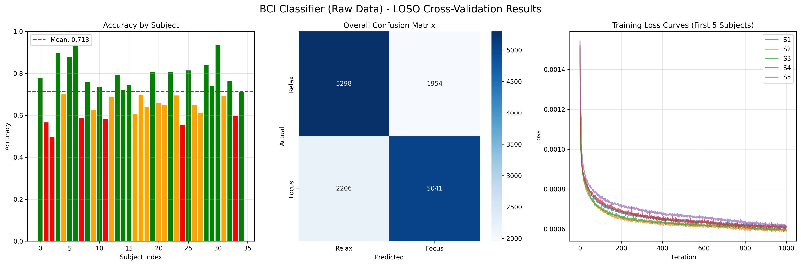

# CTNet EEG 分類器

## 專案概述

本模組實現了基於 CTNet (Convolution-Transformer Network) 的 EEG 信號分類系統，用於區分「專注」與「放鬆」兩種腦電狀態。採用 Leave-One-Subject-Out (LOSO) 交叉驗證方法，在 35 位受試者的數據集上進行訓練與評估。

## 模型架構

CTNet 結合了卷積神經網絡（CNN）和 Transformer 的優勢，用於處理 EEG 時序數據：


### 架構特點

1. **Patch Embedding CNN**：將原始 EEG 信號轉換為適合 Transformer 處理的 patch embeddings
   - 時域卷積（Temporal Convolution）
   - 深度可分離卷積（Depth-wise Convolution）
   - 空間卷積（Spatial Convolution）
   - 平均池化（Average Pooling）

2. **Transformer Encoder**：捕捉長距離時序依賴關係
   - 多頭自注意力機制（Multi-Head Self-Attention）
   - 前饋神經網絡（Feed-Forward Network）
   - 層歸一化（Layer Normalization）

3. **分類頭**：最終的分類層

### 模型配置

本專案包含兩個主要模型配置：

- **Loso_C_heads_2_depth_6_0**：6 層 Transformer encoder，2 個注意力頭
- **Loso_C_heads_2_depth_8_0**：8 層 Transformer encoder，2 個注意力頭（推薦用於即時推理）

## 數據集

### 數據格式

- **數據集路徑**：`bci_dataset_113-2/`
- **受試者數量**：35 位（S01-S35）
- **數據結構**：
  ```
  bci_dataset_113-2/
  ├── S01/
  │   ├── 1.txt  # 類別1：專注
  │   └── 2.txt  # 類別2：放鬆
  ├── S02/
  │   ├── 1.txt
  │   └── 2.txt
  └── ...
  ```

### 數據規格

- **通道數**：1 通道（單通道 EEG）
- **採樣率**：500 Hz
- **窗口大小**：1000 樣本（約 2 秒）
- **類別**：2 類（專注 vs 放鬆）

## 訓練

### 訓練方法

採用 **Leave-One-Subject-Out (LOSO)** 交叉驗證：
- 每次訓練時，使用 34 位受試者的數據作為訓練集
- 剩餘 1 位受試者的數據作為測試集
- 重複 35 次，每位受試者輪流作為測試集
- 最終得到 35 個模型（`model_1.pth` 到 `model_35.pth`）

### 訓練參數

預設配置（見 `loso.py`）：

```python
EPOCHS = 1000              # 訓練輪數
HEADS = 2                  # Transformer 注意力頭數
EMB_DIM = 16               # 嵌入維度
DEPTH = 8                  # Transformer encoder 層數
BATCH_SIZE = 512           # 批次大小
LEARNING_RATE = 0.001      # 學習率
N_AUG = 3                  # 數據增強倍數
N_SEG = 50                 # 分段次數（S&R 數據增強）
VALIDATE_RATIO = 0.1       # 驗證集比例
DROPOUT_RATE = 0.25        # Dropout 率（LOSO 模式）
```

### 數據增強

使用 **Segmentation and Reconstruction (S&R)** 方法：
- 將原始序列分段並重組
- 增加訓練數據的多樣性
- 提高模型的泛化能力

### 執行訓練

```bash
cd Classifier
python loso.py
```

訓練過程會：
1. 自動進行 LOSO 交叉驗證
2. 保存每個受試者的最佳模型
3. 生成結果 Excel 文件：
   - `result_metric.xlsx`：各受試者的評估指標
   - `process_train.xlsx`：訓練過程記錄
   - `pred_true.xlsx`：預測結果與真實標籤
4. 自動繪製結果圖表

## 推理

### 單模型推理

使用 `CTNetInference` 類進行單個模型的推理：

```python
from inference import CTNetInference

# 初始化推理器
inferencer = CTNetInference(
    model_path="Loso_C_heads_2_depth_8_0/model_1.pth",
    dataset_type='C',
    heads=2, emb_size=16, depth=8,
    eeg1_f1=8, eeg1_kernel_size=64, eeg1_D=2,
    eeg1_pooling_size1=8, eeg1_pooling_size2=8,
    eeg1_dropout_rate=0.25, flatten_eeg1=240
)

# 從 txt 文件推理
prediction, probability = inferencer.predict_from_txt("bci_dataset_113-2/S01/1.txt")
print(f"預測類別: {prediction}, 概率: {probability}")
```

### Ensemble 推理（推薦）

使用 `CTNetEnsembleInference` 類進行多模型集成推理，通常能提供更穩定和準確的結果：

```python
from inference import CTNetEnsembleInference

# 初始化 Ensemble 推理器（自動載入所有模型）
inferencer = CTNetEnsembleInference(
    model_dir="Loso_C_heads_2_depth_8_0",
    dataset_type='C',
    heads=2, emb_size=16, depth=8,
    eeg1_f1=8, eeg1_kernel_size=64, eeg1_D=2,
    eeg1_pooling_size1=8, eeg1_pooling_size2=8,
    eeg1_dropout_rate=0.25, flatten_eeg1=240
)

# 從 txt 文件推理（使用所有模型的平均預測）
prediction, probability = inferencer.predict_from_txt("bci_dataset_113-2/S01/1.txt")
print(f"預測類別: {prediction}, 概率: {probability}")
```

### 實時推理

使用滑動窗口進行連續數據流的實時推理：

```python
import numpy as np
from inference import CTNetEnsembleInference

# 初始化推理器
inferencer = CTNetEnsembleInference(
    model_dir="Loso_C_heads_2_depth_8_0",
    dataset_type='C',
    heads=2, emb_size=16, depth=8,
    eeg1_f1=8, eeg1_kernel_size=64, eeg1_D=2,
    eeg1_pooling_size1=8, eeg1_pooling_size2=8,
    eeg1_dropout_rate=0.25, flatten_eeg1=240
)

# 定義數據流生成器（模擬實時接收）
def data_stream_generator(data, chunk_size=200):
    for i in range(0, len(data), chunk_size):
        yield data[i:i+chunk_size]

# 讀取數據
data = np.loadtxt("bci_dataset_113-2/S01/1.txt", dtype=np.float32)

# 實時推理
class_names = ['放鬆', '專注']
for result in inferencer.predict_realtime(
    data_stream_generator(data, chunk_size=200),
    window_size=1000,      # 窗口大小（2秒）
    stride=500,            # 滑動步長（1秒）
    smoothing_window=5     # 平滑窗口
):
    pred = result['prediction']
    prob = result['probability']
    print(f"預測: {class_names[pred]}, 概率: {prob}")
```

### 命令行推理

```bash
# 從 txt 文件推理
python inference.py \
    --model_path Loso_C_heads_2_depth_8_0/model_1.pth \
    --txt_file bci_dataset_113-2/S01/1.txt \
    --dataset_type C \
    --heads 2 --emb_size 16 --depth 8

# 批量推理（從目錄）
python inference.py \
    --model_path Loso_C_heads_2_depth_8_0/model_1.pth \
    --data_dir ./test_data/ \
    --dataset_type C
```

### 推理範例

查看 `inference_example.py` 獲取更多使用範例：

```bash
python inference_example.py
```

## 結果展示

### 分類性能

#### 最佳結果



#### 不同訓練配置的結果比較

**Base 模型（100 epochs）**


**Extended 模型（1000 epochs）**


### 評估指標

模型評估使用以下指標：
- **準確率（Accuracy）**
- **精確率（Precision）**
- **召回率（Recall）**
- **F1 分數（F1-Score）**
- **Cohen's Kappa**

結果保存在 `result_metric.xlsx` 中，包含每位受試者的詳細指標。

### 結果視覺化

使用 `plot_figures/` 目錄下的腳本生成視覺化圖表：

- `confusion_matrix.py`：混淆矩陣
- `depth.py`：不同深度配置的比較
- `heads.py`：不同注意力頭數的比較
- `length.py`：不同窗口長度的比較

## 文件結構

```
Classifier/
├── bci_dataset_113-2/          # 數據集（35 位受試者）
│   ├── S01/
│   │   ├── 1.txt               # 專注狀態數據
│   │   └── 2.txt               # 放鬆狀態數據
│   └── ...
├── Loso_C_heads_2_depth_6_0/    # 6層模型結果
│   ├── model_1.pth ~ model_35.pth
│   ├── result_metric.xlsx
│   ├── process_train.xlsx
│   └── pred_true.xlsx
├── Loso_C_heads_2_depth_8_0/   # 8層模型結果（推薦）
│   ├── model_1.pth ~ model_35.pth
│   ├── result_metric.xlsx
│   ├── process_train.xlsx
│   └── pred_true.xlsx
├── loso.py                     # 訓練腳本
├── inference.py                # 推理腳本
├── inference_example.py        # 推理範例
├── utils.py                    # 工具函數
├── plot_figures/              # 結果視覺化腳本
│   ├── confusion_matrix.py
│   ├── depth.py
│   ├── heads.py
│   └── length.py
├── architecture.png            # 模型架構圖
├── bci_results_best.png        # 最佳結果圖
├── bci_results_data_base_e100.png
└── bci_results_data_e1000.png
```

## 依賴套件

```bash
pip install torch torchvision numpy pandas matplotlib seaborn scikit-learn einops openpyxl
```

## 使用建議

1. **訓練階段**：
   - 使用 `loso.py` 進行 LOSO 交叉驗證訓練
   - 根據 GPU 記憶體調整 `batch_size`
   - 可調整 `N_AUG` 和 `N_SEG` 來控制數據增強強度

2. **推理階段**：
   - **推薦使用 Ensemble 推理**（`CTNetEnsembleInference`）以獲得更好的穩定性
   - 對於即時應用，使用 `predict_realtime()` 方法
   - 調整 `smoothing_window` 參數來平衡響應速度和穩定性

3. **模型選擇**：
   - 8 層模型（`Loso_C_heads_2_depth_8_0`）通常表現更好，推薦用於即時推理
   - 6 層模型（`Loso_C_heads_2_depth_6_0`）計算量較小，適合資源受限的環境

## 引用

本專案基於以下論文實現：

```
Zhao, W., Jiang, X., Zhang, B. et al. CTNet: a convolutional transformer network 
for EEG-based motor imagery classification. Sci Rep 14, 20237 (2024). 
https://doi.org/10.1038/s41598-024-71118-7
```

## 注意事項

1. **CUDA 設置**：確保已正確配置 CUDA 環境，模型訓練和推理需要 GPU 支援
2. **數據格式**：確保輸入數據格式符合預期（單通道，500 Hz 採樣率）
3. **模型路徑**：推理時確保模型文件路徑正確
4. **記憶體管理**：Ensemble 推理會載入多個模型，注意 GPU 記憶體使用

## 故障排除

### 模型載入失敗

- 確認模型文件路徑正確
- 檢查模型參數配置是否與訓練時一致

### CUDA 記憶體不足

- 減小 `batch_size`
- 使用單模型推理而非 Ensemble
- 減少 `smoothing_window` 大小

### 推理結果不穩定

- 增加 `smoothing_window` 參數
- 使用 Ensemble 推理而非單模型
- 檢查輸入數據質量
