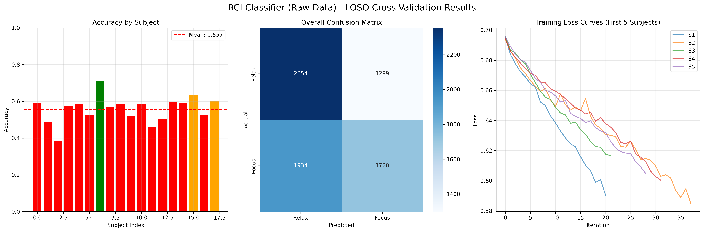

# 114-1 BME LAB Final Project - 腦機介面遊戲控制系統

> **語言版本選擇 / Language Selection**
> 
> - 🇹🇼 [繁體中文 (Traditional Chinese)](Readme_chinese.md) ← 當前版本
> - 🇺🇸 [English](Readme.md)
> 
> 您也可以點擊 README 標題旁的 📝 圖示查看歷史版本，或使用 GitHub 的分支/標籤功能切換到不同版本。

## 專案概述

本專案實現了一個基於 EEG（腦電圖）信號的遊戲控制系統，使用 CTNet（Convolution-Transformer Network）模型對腦電信號進行即時分類，並將分類結果轉換為遊戲控制指令。系統包含三個主要模組：

1. **平衡遊戲** (`balance_game/`)：一個走鋼索平衡遊戲，支援多種輸入方式
2. **EEG 分類器** (`Classifier/`)：使用 CTNet 模型進行腦電信號分類（放鬆/專注）
3. **即時服務器** (`server_client/`)：接收 BIOPAC EEG 數據，進行即時分類並控制遊戲

## 專案結構

```
114-1_BME_LAB_Final_Project_G5/
├── balance_game/              # 平衡遊戲模組
│   ├── assets/                # 遊戲資源（圖片、字體等）
│   ├── balance_game/           # 遊戲核心代碼
│   │   ├── game.py            # 遊戲主邏輯
│   │   ├── input.py           # 輸入處理
│   │   ├── blink_detector.py  # 眨眼偵測
│   │   └── brainlink.py       # BrainLink 整合
│   ├── tools/                 # 工具腳本
│   │   ├── brainlink_serial_bridge.py
│   │   ├── brainlink_socket_bridge.py
│   │   └── train_blink_energy.py
│   ├── main.py                # 遊戲入口
│   └── README.md              # 遊戲使用說明
│
├── Classifier/                 # EEG 分類器模組
│   ├── bci_dataset_113-2/     # BCI 數據集（35 位受試者）
│   ├── Loso_C_heads_2_depth_6_0/  # 訓練模型（6層）
│   ├── Loso_C_heads_2_depth_8_0/  # 訓練模型（8層）
│   ├── loso.py                # CTNet 模型架構與訓練
│   ├── inference.py           # 推理腳本
│   ├── inference_example.py   # 推理範例
│   ├── utils.py              # 工具函數
│   ├── plot_figures/         # 結果視覺化腳本
│   └── README.md             # 分類器說明
│
└── server_client/             # 即時服務器模組
    ├── eeg_server_ctnet.py   # EEG 服務器主程式
    ├── inference.py          # 推理模組
    ├── loso.py              # CTNet 模型
    ├── utils.py             # 工具函數
    ├── test_game_control.py # 遊戲控制測試
    ├── Loso_C_heads_2_depth_8_0/  # 模型文件
    └── GAME_CONTROL_README.md    # 遊戲控制說明
```

## 安裝說明

### 1. 環境設置

```bash
# 創建虛擬環境（首次使用）
python -m venv .venv

# 啟動虛擬環境
source .venv/bin/activate  # macOS/Linux
# 或
.venv\Scripts\activate      # Windows

# 安裝依賴
pip install -r balance_game/requirements.txt
pip install torch torchvision numpy pandas matplotlib seaborn scikit-learn einops
```

### 2. 編譯遊戲模組

```bash
python -m compileall balance_game
```

## 使用說明

### 快速開始：使用 EEG 控制遊戲

#### 步驟 1：啟動遊戲

在一個終端中啟動遊戲並開啟 socket 輸入：

```bash
source .venv/bin/activate
cd balance_game
python main.py --socket-input --socket-port 4789
```

#### 步驟 2：啟動 EEG 分類服務器

在另一個終端中啟動分類服務器：

```bash
source .venv/bin/activate
cd server_client
python eeg_server_ctnet.py
```

服務器會：
- 監聽 BIOPAC 的 EEG 數據（預設端口 50007）
- 使用 CTNet 模型進行即時分類
- 將分類結果轉換為遊戲控制指令並發送到遊戲

#### 控制邏輯

- **放鬆狀態** → 向左傾斜 (`lean: -0.5`)
- **專注狀態** → 向右傾斜 (`lean: 0.5`)
- **眨眼** → 觸發跳躍 (`jump: true`)

### 其他使用方式

#### 使用 BrainLink 直接控制

```bash
# 終端 1：啟動遊戲
python main.py --socket-input --socket-port 4789

# 終端 2：啟動 BrainLink 橋接
python tools/brainlink_serial_bridge.py \
    --serial-port /dev/cu.BrainLink_Lite \
    --profile assets/blink_energy_profile.json \
    --game-port 4789 \
    --verbose
```

#### 使用鍵盤控制

```bash
python main.py
```

控制方式：
- `A` / `←`：向左傾斜
- `D` / `→`：向右傾斜
- `Space` / `↑`：跳躍

詳細說明請參考各模組的 README：
- [遊戲使用說明](balance_game/README.md)
- [遊戲控制整合說明](server_client/GAME_CONTROL_README.md)

## Classifier 結果

本專案使用 CTNet（Convolution-Transformer Network）模型進行 EEG 信號分類，採用 Leave-One-Subject-Out (LOSO) 交叉驗證方法，在 35 位受試者的數據集上進行訓練與評估。

### 模型架構


### 分類結果

#### 最佳結果


#### 不同訓練設定的結果比較

**Base 模型（100 epochs）**


**Base 模型（18 位受試者，來自 [114-1_BME_Exp3_group_5](https://github.com/Lukelaitw/114-1_BME_Exp3_group_5)）**



### 模型配置

專案中包含兩個主要模型配置：

- **Loso_C_heads_2_depth_6_0**：6 層 Transformer encoder，2 個注意力頭
- **Loso_C_heads_2_depth_8_0**：8 層 Transformer encoder，2 個注意力頭（用於即時推理）

### 訓練與評估

詳細的訓練和評估方法請參考：
- [Classifier README](Classifier/README.md)
- `Classifier/loso.py`：模型訓練腳本
- `Classifier/inference.py`：推理腳本

## 技術細節

### CTNet 模型

本專案基於以下論文實現：

**Citation:**
```
Zhao, W., Jiang, X., Zhang, B. et al. CTNet: a convolutional transformer network 
for EEG-based motor imagery classification. Sci Rep 14, 20237 (2024). 
https://doi.org/10.1038/s41598-024-71118-7
```

### 數據處理

- **採樣率**：500 Hz（BIOPAC）
- **窗口大小**：1000 樣本（約 2 秒）
- **步長**：300 樣本（約 0.6 秒）
- **通道數**：22 通道 EEG

### 即時推理

- 使用滑動窗口進行連續數據處理
- 支援平滑處理以減少預測波動
- 眨眼偵測基於原始 EEG 信號的振幅分析

## 故障排除

### 連接問題

如果遇到 `Connection refused` 錯誤：

1. 確認遊戲已啟動並使用 `--socket-input` 參數
2. 確認端口號碼正確（預設 4789）
3. 使用 `test_game_control.py` 測試連接

### 模型載入問題

1. 確認模型文件存在於 `server_client/Loso_C_heads_2_depth_8_0/` 目錄
2. 檢查模型路徑配置是否正確

### 數據格式問題

1. 確認 BIOPAC 數據格式符合預期
2. 檢查採樣率是否為 500 Hz

## 開發團隊

114-1 BME LAB Final Project Group 5

## 授權

請參考各模組的授權文件。

